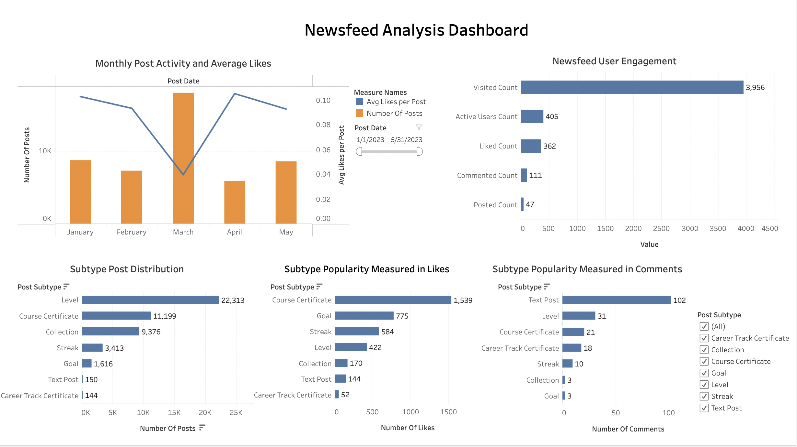

# **Newsfeed Analysis Project**

## **Project Overview**
The **Newsfeed Analysis** project focuses on providing insights into user engagement and content performance within the newsfeed platform. The target audience includes **product managers, content strategists, and UX designers**, aiming to enhance user interaction and ensure content resonates with the audience.

*This report is based on the project exercise from [365 Data Science](https://learn.365datascience.com/projects/newsfeed-analysis-in-tableau/).*

## **Visual Overview**

Following the data extracted from the provided CSV files, the image above illustrates key insights regarding user engagement, post distribution, and performance metrics within the newsfeed feature. The analysis focuses on various post subtypes, user interaction patterns, and engagement levels. These observations allow for data-driven decisions to improve content relevance and user participation.

## **Key Insights and Results**

### **1. Least Favored Post Subtype in Terms of Average Likes**
- **Insight**: The **Text Post** subtype receives the lowest average likes per post, indicating limited user interest.
   - Lower engagement with textual content compared to other subtypes.
   - Users demonstrate a preference for visual or achievement-based content.
   - Strategies such as incorporating multimedia could help improve engagement.

### **2. Most and Least Common Post Types on the Newsfeed**
- **Insight**: The **Course Certificate** subtype is the most common, while **Goal** posts are the rarest.
   - Course Certificates dominate, suggesting frequent user activity related to course completion.
   - Goal posts are infrequent, indicating less interest in public goal-sharing.
   - Encouraging users to share more goal-based achievements could increase engagement in this area.

### **3. Percentage of Visitors Who Actively Interacted with the Newsfeed**
- **Insight**: Approximately **30%** of visitors actively engage with the newsfeed by liking, commenting, or posting.
   - A significant portion of users remains passive, consuming content without interaction.
   - Increasing active participation should be a focus for future improvements.
   - Incentives for interaction, such as gamification or rewards, could encourage greater user involvement.

### **4. Recommendations to Enhance User Interaction**
- **Insight**: Focus on enhancing the visibility and interaction of subtypes that are frequent but less engaging.
   - **Text Posts**, despite being common, have low engagement. More interactive content like polls or visuals could boost interest.
   - Boosting the visibility of **Goal** posts through challenges or peer recognition could further encourage sharing.
   - Highlighting achievements with community recognition could drive additional user engagement.

### **5. Additional Insights**
- **Comment Engagement**: **Course Certificates** generate the highest number of comments, showing a strong user response to achievement-based posts.
   - Encouraging peer interaction through comments on achievements fosters a sense of community.
   - Introducing features for users to congratulate or comment on milestones could boost interaction rates further.

## **Conclusion**
The analysis reveals areas of opportunity to increase engagement and refine content strategies within the newsfeed. By focusing on underperforming subtypes, promoting interactive content, and leveraging community-driven features, we can optimize the user experience and ensure higher engagement across the platform.

---
*Source: [Newsfeed Analysis in Tableau](https://learn.365datascience.com/projects/newsfeed-analysis-in-tableau/)*
